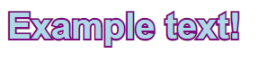

# stroked-text
### Easy stroked text in React using SVGs, written in TypeScript

## Usage
```
import { StrokedText } from 'stroked-text';

<StrokedText fill='lightblue' stroke='purple' strokeWidth={10} style={{
    font: 'bold 40px sans-serif',
}}>Example text!</StrokedText>
```
Result:


## Props
*All properties are optional.*
### `style: React.CSSProperties`
The CSS style of the `SVG` element. In most cases, you can put the styling for your text here.

### `children: string`
The `children` prop is just what's in between the opening and closing `StrokedText` tags. It's the text that gets stroked.

### `stroke: string`
The CSS `stroke` style. It's the color of the stroke.

### `strokeWidth: number`
The width of the stroke, in pixels.

### `fill: string`
The fill color of the text.

### `paintOrder: string`
What order to paint the stroke and fill in. For example, `'stroke fill'` (default) will put the text fill over the stroke, and `'fill stroke'` will put the stroke on top of the text. Same as the `paint-order` CSS property. Doesn't work in IE (IE will always show `fill stroke`)

#### `stroke fill`


#### `fill stroke`


### `textStyle: React.CSSProperties`
The text styling to put on the actual `SVG` `text` element. Most of the time, you won't have to use this.

### `textClassName: string`
The CSS class name to apply to the text

### `className: string`
The CSS class name to apply to the whole SVG element

## Example project
https://github.com/SploxFox/StrokedTextExample
## Notes
* Text does not wrap -- you would have to simulate this yourself
* Text is highlightable and everything
* On some browsers, the text's stroke may extend outside of the element's bounding box
* The element may be slightly different sizes across different browsers even if the font size is the same